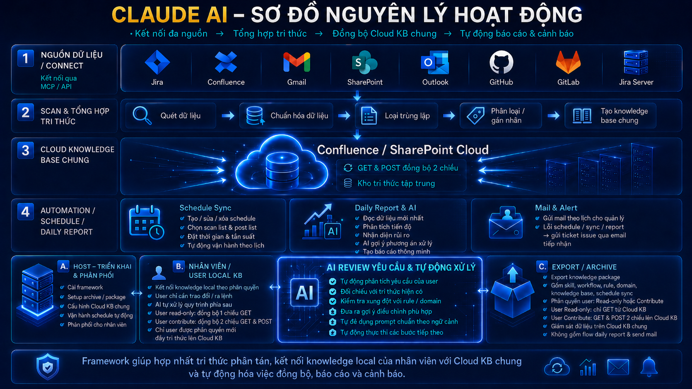

<div align="center">

# 🦊 Claude AI — Framework

### Bộ não thứ hai tự lớn lên cùng dự án

**Kết nối đa nguồn → Tổng hợp tri thức → Đồng bộ Cloud KB chung → Tự động báo cáo & cảnh báo**

[](./version.json)
[](./CHANGELOG.md)
[](#-cài-đặt)
[](https://claude.ai/code)
[](https://fpt.vn)

<a href="https://isc-fkit.github.io/Kora-Framework/#home"><b>📖 Hướng dẫn đầy đủ</b></a> ·
<a href="#-cài-đặt"><b>⚙️ Cài đặt</b></a> ·
<a href="#-các-lệnh-kora"><b>📚 Lệnh</b></a> ·
<a href="#-bảo-mật--khóa-token"><b>🔐 Bảo mật</b></a>



</div>

---

KORA hợp nhất tri thức phân tán (Jira, Confluence, GitHub, SharePoint…) thành một **knowledge base có
cấu trúc, liên kết kiểu wiki**, đồng bộ hai chiều với **Cloud KB chung** (Confluence / GitHub private),
và **tự động hóa** báo cáo tiến độ — cảnh báo rủi ro. Người **không cần biết kỹ thuật** chỉ nhắn bằng
lời thường; mọi bước AI tự chạy, **bạn chỉ confirm**.

## Mục lục

- [Tính năng](#-tính-năng)
- [Nguyên lý hoạt động](#-nguyên-lý-hoạt-động)
- [Cài đặt](#-cài-đặt)
- [Hành trình sử dụng](#-hành-trình-sử-dụng)
- [Các lệnh /claude-knowledge-*](#-các-lệnh-kora)
- [Template phân tích theo vai trò](#-template-phân-tích-theo-vai-trò)
- [Bảo mật & khóa (token)](#-bảo-mật--khóa-token)
- [Bàn giao & đồng bộ](#-bàn-giao--đồng-bộ)
- [Cấu trúc dự án](#-cấu-trúc-dự-án)
- [Cấu hình](#-cấu-hình)
- [Đóng góp](#-đóng-góp)

## ✨ Tính năng

| | |
|---|---|
| 🔌 **Kết nối đa nguồn** | Jira (Cloud/Server), Confluence, GitHub, GitLab, SharePoint, Outlook, Gmail — qua **MCP** hoặc **API** (OAuth 2.0 / PAT). API và MCP tính riêng. |
| 🔎 **Scan & tổng hợp** | Quét cào hết field (kể cả comment) → chuẩn hóa → loại trùng lặp → dựng **wiki liên kết** mỗi project; tùy chọn đào sâu thành feature / BR / AC. |
| ☁️ **Đồng bộ Cloud KB** | Đẩy/kéo **idempotent** lên Confluence chung và **GitHub private** (git push). Versioning US ↔ Change-Request (giữ bản cũ, đánh dấu superseded, link bản mới). |
| 📊 **Báo cáo tiến độ** | Dashboard nhiều project × thành viên × loại hạng mục công việc, **lọc chi tiết**, phân tích **giờ công chuẩn vs đã log + OT**, cảnh báo rủi ro — nhìn sơ là nắm tình hình. |
| ✉️ **Mail & cảnh báo** | Gửi báo cáo (Gmail / Outlook / SMTP) có banner; lỗi lịch tự bắn ticket + email. |
| ⏰ **Lịch cấp HĐH** | launchd / cron / schtasks — chạy đúng giờ **kể cả khi đóng app**. |
| 📝 **Template động** | Prompt + tài liệu (BRD/PRD…) tự điều chỉnh theo **vai trò (BA/PO/SA/QA)** và **domain** đang chọn. |
| 📦 **Archive bàn giao** | Đóng gói KB có **mật khẩu + phân quyền** (read-only / read-write) để giao cho user khác. |
| 🔐 **Cổng mật khẩu** | Sync / gửi mail / sync-trong-lịch đi qua mật khẩu vận hành; export thì không. |

## 🧭 Nguyên lý hoạt động

```text
  ┌─────────────┐   ┌──────────────────┐   ┌───────────────────┐   ┌──────────────────────────┐
  │ 1. NGUỒN    │   │ 2. SCAN & TỔNG    │   │ 3. CLOUD KB CHUNG  │   │ 4. AUTOMATION            │
  │   (Connect) │──▶│   HỢP (wiki KB)   │──▶│  Confluence/GitHub │──▶│  Schedule · Report · Mail │
  │  MCP / API  │   │  chuẩn hóa·dedup  │   │  GET & POST (idemp) │   │  · Alert (ticket lỗi)    │
  └─────────────┘   └──────────────────┘   └───────────────────┘   └──────────────────────────┘
```

## ⚙️ Cài đặt

Một bộ cài cho **cả Claude CLI và Desktop**. Cài skill vào `~/.claude` và tự tạo sẵn project trong
`Downloads/Knowledge-Base` (folder `Skill/` bên trong).

**macOS / Linux (bash):**
```bash
bash <(curl -fsSL https://raw.githubusercontent.com/isc-fkit/Kora-Framework/release/install.command)
```

**Windows (cmd / PowerShell):**
```bat
curl -fsSL https://raw.githubusercontent.com/isc-fkit/Kora-Framework/release/install.bat -o "%TEMP%\kora-install.bat" && "%TEMP%\kora-install.bat"
```

> Không quen Terminal? Tải `install.command` / `install.bat` rồi chạy. macOS lần đầu bị chặn →
> **System Settings → Privacy & Security → Open Anyway**. Khi cài, **cấp quyền** truy cập thư mục
> project + chạy script + các Connector cần dùng.

Chạy lại cùng lệnh = **cập nhật**. Gỡ: `/claude-knowledge-uninstall` (hoặc `uninstall.command` / `uninstall.bat`).

## 🚀 Hành trình sử dụng

```text
setup → init → connect → scan → schedule → mail → archive
```

1. **`/claude-knowledge-init`** — chọn domain (một / nhiều / tất cả → rule GỘP), tên project, vault.
   - *(tùy chọn)* **`/claude-knowledge-ops-password`** — đặt mật khẩu admin 1 lần (cho lịch nền + report/mail/sync).
2. **`/claude-knowledge-connect`** — kết nối nguồn (MCP/API); xem nguồn đã kết nối.
3. **`/claude-knowledge-scan`** — quét & tổng hợp (scan-all hoặc chọn project).
4. **`/claude-knowledge-sync`** — đẩy KB lên Confluence / GitHub private (có cổng mật khẩu).
5. **`/claude-knowledge-schedule`** — lịch nền: get → mật khẩu → report → mail → (tùy chọn) sync.
6. **`/claude-knowledge-send-mail`** — gửi báo cáo, gửi ngay hoặc đặt lịch.
7. **`/claude-knowledge-archive`** — đóng gói bàn giao có phân quyền.

## 📚 Các lệnh /claude-knowledge-*

> 👥 **Dùng trong Cowork (Claude Desktop/Web):** bộ cài tạo sẵn folder **`Skill/`** trong thư mục
> project. Để bật các lệnh `/claude-knowledge-*`: **kéo các file skill trong `Skill/` vào Cowork** rồi bảo Claude
> *"cài skill này"*, **hoặc** vào **Customize → Custom Skills** để thêm skill tùy chỉnh. (Bản CLI:
> installer đã đặt sẵn ở `~/.claude/commands/`, bỏ qua bước này.)

| Lệnh | Việc | Gác mật khẩu |
|---|---|:--:|
| `/claude-knowledge-init` | Khởi tạo dự án (domain, rule, project, vault) | |
| `/claude-knowledge-ops-password` | Đặt mật khẩu admin 1 lần (`~/.config/claude-knowledge/ops-pw.env`) — mở cổng sync/mail/report/lịch | |
| `/claude-knowledge-connect` | Kết nối nguồn / xem nguồn đã kết nối | |
| `/claude-knowledge-scan` | Quét & nạp tri thức + tổng hợp wiki | |
| `/claude-knowledge-scan-jira-task` | Quét 1 task/epic Jira theo mã | |
| `/claude-knowledge-import-files` | Nạp PDF / DOCX / ảnh / zip Obsidian | |
| `/claude-knowledge-sync` | Đẩy KB lên Confluence / GitHub private (versioning) | 🔒 |
| `/claude-knowledge-send-mail` | Gửi báo cáo (Gmail/Outlook/SMTP), ngay/đặt lịch | 🔒 |
| `/claude-knowledge-schedule` | Lịch cấp HĐH: get → report → mail → (tùy chọn) sync | 🔒¹ |
| `/claude-knowledge-daily-report` | Báo cáo tiến độ (chọn project, lọc, theo thời gian) | |
| `/claude-knowledge-archive` | Đóng gói KB phân quyền + mật khẩu để bàn giao | 🔑² |
| `/claude-knowledge-export-docs` | Xuất tài liệu DOCX / PDF theo doc template | |
| `/claude-knowledge-export-knowledge-base` | Xuất toàn bộ KB ra zip (sao lưu / dời máy) | |
| `/claude-knowledge-evolve` | Dọn / tiến hóa / kiểm tra sức khỏe KB | |
| `/claude-knowledge-version` | Xem phiên bản đang cài + so với bản mới nhất (chỉ đọc) | |
| `/claude-knowledge-update` · `/claude-knowledge-uninstall` | Cập nhật app/skill · Gỡ skill | |

<sub>¹ bước **sync** trong lịch gác bằng `KORA_OPS_PW`. ² archive gác bằng mật khẩu riêng, chỉ chặn HOST tạo gói.</sub>

## 📝 Template phân tích theo vai trò

Khi user yêu cầu phân tích, KORA hỏi **vai trò** → nạp **prompt mẫu động** → hỏi/áp **domain rule** →
đề xuất **doc template**. Prompt tự thay `[domain]` theo cấu hình và đổi "lăng kính" theo vai trò:

| Vai trò | Prompt | Doc template | Output |
|---|---|---|---|
| BA | `templates/prompts/role-ba.md` | `templates/docs/BRD-template.md`, `PRD-template.md` | Actors, tính năng, user story |
| PO | `templates/prompts/role-po.md` | BRD, Roadmap | Business value, KPI, MoSCoW |
| SA | `templates/prompts/role-sa.md` | PRD (Part B), SDD | Kiến trúc, data model, API, NFR |
| QA | `templates/prompts/role-qa.md` | Test plan | AC, test scenario, edge case |

Bản đồ: `templates/prompts/_index.md` · output mẫu đã điền: `templates/examples/`.

## 🔐 Bảo mật & khóa (token)

- **Khóa mặc định ở SHELL ENV**, KHÔNG rải `.env` trong project: `export KORA_<SRC>_TOKEN=…` trong
  `~/.zshrc` / `~/.bashrc`. Các tool đọc qua `os.getenv`.
- **Chỉ tạo `.env.local`** ở 2 ca: **archive** (ship 1 key read-only) và **lịch sync nền** (mỗi nguồn
  user chọn auto-sync mới có `.env.local` riêng — cron/launchd không đọc shell tương tác).
- Token **KHÔNG** vào chat / log / git / config. github-sync bơm PAT qua `GIT_CONFIG_*` (không vào
  `.git/config`/argv). Hai cổng mật khẩu tách biệt: **archive** (HOST tạo gói) và **ops** `KORA_OPS_PW`
  (sync / mail / sync-trong-lịch). `/claude-knowledge-export-*` **không** gác.

## 📦 Bàn giao & đồng bộ

HOST đẩy KB lên **GitHub private / Confluence** → `/claude-knowledge-archive` ship gói USER (key đọc + tắt
report/mail). USER mở **Claude Desktop** → tạo project → **import gói host export** → connect MCP tới
nguồn đó → `/claude-knowledge-schedule` tạo lịch **kéo (pull)** → đúng giờ tự đồng bộ KB về local. Project import
luôn **hỏi để nắm tri thức** trước khi trả lời (tránh lạc đề).

## 🗂️ Cấu trúc dự án

```text
.claude/commands/     # Skill /claude-knowledge-* (markdown)
workflows/            # Kịch bản step-by-step cho từng luồng
config/               # domain presets, rule, factory-config, ops-pw.sha256
templates/            # prompts/ (theo vai trò) · docs/ (BRD/PRD) · examples/
tools/
  connections/        # sổ đăng ký + probe nguồn
  jira-to-obsidian/   # quét Jira → vault
  kb-synth/           # tổng hợp wiki nhẹ
  kb-sync/            # versioning US↔Change-Request
  confluence-sync/    # đẩy/kéo KB ↔ Confluence (REST + OAuth)
  github-sync/        # đẩy KB → GitHub private (git push)
  kora-scheduler/     # lịch HĐH + orchestrator
  progress-report/    # dashboard tiến độ
  report-mailer/      # gửi email (SMTP)
  archive-gate/       # cổng mật khẩu (archive + ops)
docs/                 # KB chính (chỉ ghi sau khi duyệt)
assets/               # ảnh landing + banner email
```

## ⚙️ Cấu hình

Tất cả trong `config/factory-config.yaml` (DATA, gitignore) — bản mẫu `config/factory-config.example.yaml`.
Mọi giá trị **động** (đường dẫn, domain, vault, lịch, target sync, người nhận mail, banner) — không hardcode.

## 🤝 Đóng góp

Repo vừa là **landing** (GitHub Pages tự deploy mỗi push) vừa là **app base**. Sửa CORE muốn app đã cài
nhận được → **tăng `version.json` + ghi `CHANGELOG.md`** → push (`/claude-knowledge-release` cho maintainer). Chỉ sửa
landing (`index.html`) → giữ nguyên `version.json`. Xem `RELEASING.md`.

---

<div align="center"><sub>Made with 🦊 by <b>FPT Telecom</b> · Claude AI — Claude-1</sub></div>
