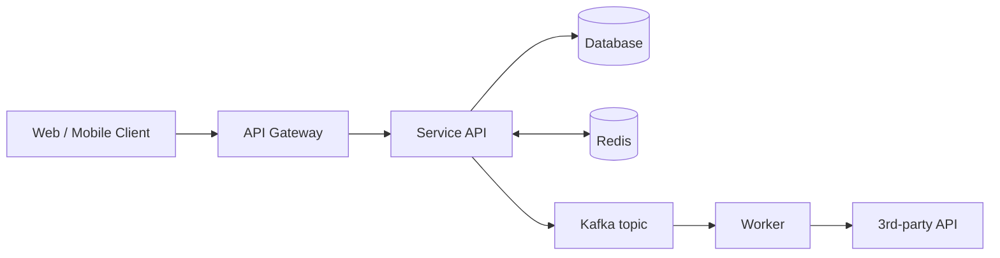
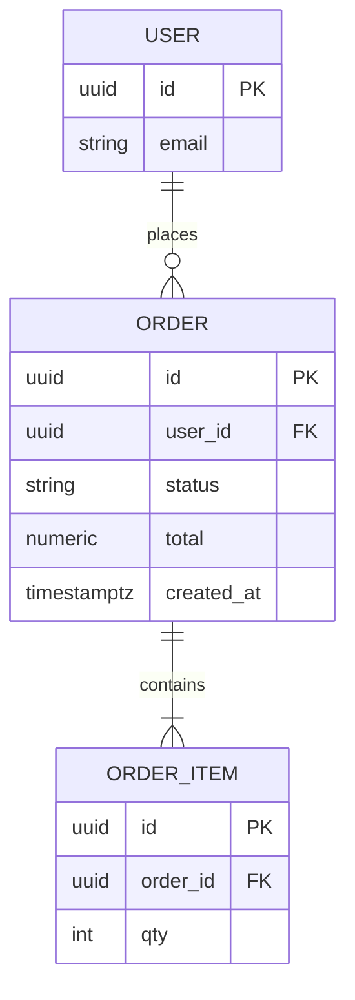
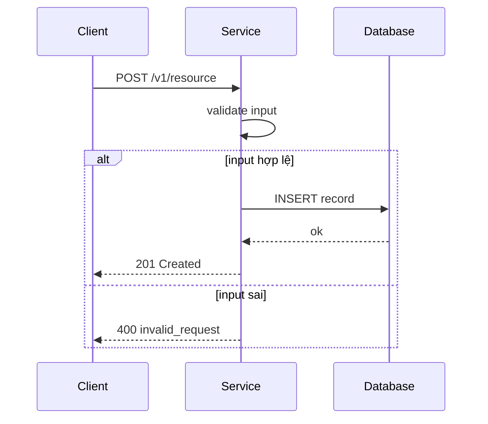

# PRD + Tech Spec (Lean) — `<TÊN TÍNH NĂNG / DỰ ÁN>`

> **Mục đích:** Tài liệu gộp What / Why / How (PRD + SDD), đủ để engineer (kể cả người mới vào dự án) hiểu, build và vận hành mà không cần hỏi lại.
> **Quy ước:**
> - Điền vào chỗ `<...>`. Mục không dùng → ghi `N/A — lý do` rồi bỏ qua, đừng xóa heading.
> - Living document, để trong repo cùng code (`docs/<feature>.md`), update qua PR + bump version ở Mục 21.
> - Diagram dùng **Mermaid** (text-based). Trong `sequenceDiagram` **không dùng dấu `;`** trong nội dung message (Mermaid hiểu `;` là ngắt dòng → vỡ chart). Dùng dấu phẩy hoặc tách dòng.

> **Cấu trúc 3 phần:**
> - **Part A — Product (Mục 1–6):** WHAT & WHY. PM/BA đọc hiểu được.
> - **Part B — Design (Mục 7–16):** HOW. Engineer build dựa vào đây.
> - **Part C — Delivery (Mục 17–21):** BUILD / SHIP / OPERATE.

> **Thứ tự đọc gợi ý:**
> 1. Mục 2 (Scope) — biết ranh giới làm gì, không làm gì
> 2. Mục 3 + 4 + 5 (User stories + Functional requirements + Acceptance criteria) — làm gì và "done" khi nào
> 3. Mục 7–11 (Glossary, Kiến trúc, Data, API, Luồng) — thiết kế thế nào
> 4. Mục 13–16 (Security, Performance, Reliability, Observability) — chạy an toàn thế nào
> 5. Mục 17 + 18 (Testing/DoD, Rollout) — kiểm thử và ship thế nào
>
> Khi có mâu thuẫn giữa các mục: **Scope (Mục 2)** và **Acceptance criteria (Mục 5)** là nguồn chân lý cao nhất.

---

## 0. Metadata

| Field | Value |
|---|---|
| Tên | `<short, outcome-oriented>` |
| Trạng thái | Draft / In Review / Approved / Building / Done |
| Owner (DRI) | `<Eng DRI: Tech Lead/SA · Product DRI: PM/BA>` |
| Version | `0.1` |
| Repo / package | `<repo path>` |
| Tech stack bắt buộc | `<ngôn ngữ, framework, DB, hạ tầng — phải tuân theo>` |
| Upstream BRD | `<link / mã BRD>` |
| Cập nhật | `YYYY-MM-DD` |

---

# PART A — PRODUCT (What & Why)

## 1. Vấn đề & mục tiêu (Why + What)

**Vấn đề:** `<3–4 câu. Người dùng/business đang gặp khó khăn gì. Mô tả vấn đề, KHÔNG mô tả giải pháp.>`

**Mục tiêu:** `<1–3 mục tiêu, đo được.>`

| # | Mục tiêu | Đo bằng | Target |
|---|---|---|---|
| G1 | `<outcome>` | `<metric>` | `<value>` |

---

## 2. Phạm vi (Scope)

> Đây là phần **quan trọng nhất** — định ranh giới để không build thừa, không build thiếu.

**In scope (release này LÀM):**
- `<capability 1>`
- `<capability 2>`

**Out of scope (release này KHÔNG làm):**
- `<thứ dễ bị hiểu nhầm là nằm trong scope — nêu rõ để loại trừ>`
- `<tính năng để dành phase sau>`

---

## 3. Người dùng & User Stories

> **User story** = nhu cầu + giá trị (một câu, đơn vị backlog). **Use case** (chuỗi bước tương tác) nằm ở Mục 11. Đừng gộp hai thứ làm một.

**Người dùng (actor):**

| Persona | Vai trò & bối cảnh |
|---|---|
| `<VD: Nhân viên vận hành>` | `<vai trò, môi trường làm việc, mức thành thạo>` |

**User stories** (mỗi story link về Capability của BRD):

| # | Là... (role) | Tôi muốn... | Để... | Capability (BRD) | Ưu tiên | AC |
|---|---|---|---|---|---|---|
| US1 | `<persona>` | `<hành động / khả năng>` | `<giá trị nhận được>` | `C1` | Must | AC-1 |
| US2 | `<persona>` | `<...>` | `<...>` | `C1` | Must | AC-2 |
| US3 | `<persona>` | `<...>` | `<...>` | `C2` | Should | AC-3 |

---

## 4. Yêu cầu chức năng (Functional Requirements)

> Liệt kê **capability**, không phải cách implement. Ưu tiên: Must / Should / Could.

| # | Yêu cầu | Ưu tiên | Liên kết (US · AC) |
|---|---|---|---|
| FR-01 | System MUST `<cho phép user làm gì, trong điều kiện gì>` | Must | US1 · AC-1 |
| FR-02 | System MUST validate `<input>` theo `<rule>` trước khi lưu | Must | US1 · AC-2 |
| FR-03 | System SHOULD `<nicety>` | Should | US3 · AC-3 |

---

## 5. Acceptance criteria (điều kiện nghiệm thu — phải test được)

> Mỗi **user story** (Mục 3) có ít nhất 1 AC dạng Given/When/Then; FR liên quan trỏ về cùng AC.

**AC-1 — `<tiêu đề>`**
```gherkin
Given <tiền điều kiện>
When <hành động>
Then <kết quả quan sát được>
And <kết quả phụ, nếu có>
```

**AC-2 — `<tiêu đề>`**
```gherkin
Given <...>
When <input không hợp lệ>
Then <trả lỗi rõ ràng, không crash>
```

---

## 6. Yêu cầu phi chức năng (high-level)

> Đây là **target mức product**. Cách đạt được chi tiết ở Mục 13 (Security), 14 (Performance), 15 (Reliability), 16 (Observability).

| Khía cạnh | Yêu cầu |
|---|---|
| Performance | `<VD: API p99 < 300ms; trang load < 2s>` |
| Bảo mật | `<VD: cần auth Bearer JWT; validate mọi input; không log PII>` |
| Quy mô | `<VD: ~1k user, 50 RPS lúc launch; năm 1: 200 RPS>` |
| Availability | `<VD: SLA 99.9%>` |
| Tương thích | `<VD: backward-compatible API v1; trình duyệt 2 bản gần nhất>` |
| Dữ liệu nhạy cảm | `<Public / Internal / PII — nếu PII: mã hóa + retention + vùng lưu trữ>` |
| Compliance | `<VD: NĐ 13/2023, PCI-DSS — nếu có>` |

---

# PART B — DESIGN (How)

## 7. Glossary & khái niệm chính

> Mọi thuật ngữ domain/internal dùng trong Part B/C phải có ở đây — tránh nhập nhằng giữa các team.

| Thuật ngữ | Định nghĩa |
|---|---|
| `<term>` | `<định nghĩa>` |
| `<term>` | `<định nghĩa>` |

---

## 8. Kiến trúc tổng thể



| Thành phần | Trách nhiệm | Mới / Có sẵn |
|---|---|---|
| `Service API` | Xử lý request đồng bộ, validate, lưu dữ liệu | New |
| `Worker` | Xử lý bất đồng bộ các event từ Kafka | New |
| `Database` | Nguồn chân lý cho `<entity>` | `<New / Existing>` |
| `Redis` | Cache + idempotency key | Existing |
| `3rd-party API` | `<mục đích>` | Existing |

**Quyết định thiết kế chính (one-liner; lý do đầy đủ ở Mục 19):** `<chọn X thay vì Y vì ...>`

---

## 9. Data model



- **Index:** `<liệt kê index + query pattern nó phục vụ>`
- **Partition / shard:** `<key + lý do; nếu không có, ghi N/A>`
- **PII:** `<field nào là PII; mã hóa ở mức nào>`
- **Retention & delete:** `<giữ bao lâu; soft hay hard delete + lý do>`

---

## 10. API / Interface

> [!NOTE]
> Cấu trúc request/response và bộ mã lỗi dưới đây **tham khảo tiêu chuẩn nội bộ ISC**. Tuân theo convention chung của ISC (đặt tên field, format lỗi, versioning); phần dưới chỉ là khung mẫu — chỉnh theo chuẩn ISC hiện hành khi áp dụng.

| Method | Path | Mục đích | Auth | Idempotent |
|---|---|---|---|---|
| `POST` | `/v1/<resource>` | Tạo mới | Bearer | Yes (Idempotency-Key) |
| `GET` | `/v1/<resource>/{id}` | Lấy chi tiết | Bearer | Yes |
| `GET` | `/v1/<resource>?limit=&cursor=` | Liệt kê (cursor-based) | Bearer | Yes |

**Ví dụ contract — `POST /v1/<resource>`** *(format theo chuẩn ISC)*

Request:
```json
{ "field_a": "<value>", "field_b": 123 }
```
Response (201):
```json
{ "id": "<uuid>", "status": "created", "created_at": "<iso8601>" }
```

**Mã lỗi chuẩn** *(tham khảo bộ mã lỗi tiêu chuẩn nội bộ ISC)***:**

| HTTP | Code | Khi nào |
|---|---|---|
| 400 | `invalid_request` | Body sai / validate fail |
| 401 | `unauthorized` | Thiếu/sai token |
| 404 | `not_found` | Không tồn tại |
| 409 | `conflict` / `idempotency_conflict` | Trùng / xung đột trạng thái |
| 422 | `business_rule_violation` | Vi phạm rule nghiệp vụ |
| 429 | `rate_limited` | Vượt rate limit |
| 503 | `dependency_unavailable` | Upstream (payment, legacy...) down |

**Versioning & pagination:** `<URL path versioning /v1; cursor-based, page size mặc định/max>`

---

## 11. Luồng chính & state machine (use case / key flow)

> Đây là **use case** — chuỗi bước tương tác actor ↔ system, gồm luồng chính + nhánh lỗi. Bổ trợ cho user story ở Mục 3.



**State machine `<entity>.status`:** `<liệt kê trạng thái và transition hợp lệ, VD: draft → submitted → done. Transition khác → trả 409/422.>`

---

## 12. Algorithms / business logic phức tạp

> Chỉ điền khi có thuật toán/logic phức tạp đáng tài liệu hóa (pricing, matching, allocation, scoring...). Nếu không → `N/A`.

- **Input / Output:** `<...>`
- **Các bước:** `<mô tả ngắn hoặc pseudo-code>`
- **Vì sao chọn cách này:** `<lý do; alternative xem Mục 19>`

---

## 13. Security & privacy

**Authn / Authz:** `<VD: Bearer JWT do auth-service phát; RBAC role <list>; service-to-service mTLS>`

**Threat model (rút gọn):**

| Mối đe dọa | Phòng vệ |
|---|---|
| Giả mạo danh tính (Spoofing) | `<verify chữ ký JWT tại gateway>` |
| Sửa payload (Tampering) | `<TLS + validate schema>` |
| Lộ dữ liệu (Info disclosure) | `<redact PII trong log; mã hóa at rest>` |
| Lạm quyền (Elevation) | `<deny-by-default; test authz>` |
| DoS | `<rate limit + circuit breaker>` |

**Input validation:** `<schema validation ở gateway; parameterized query (chống SQLi); không trả HTML>`
**Secrets:** `<nguồn: Vault/Secrets Manager; rotate; không commit, không log>`
**Privacy / PDPA:** `<field PII; hỗ trợ export/xóa; retention job; data ở vùng nào>`

---

## 14. Performance & capacity

**Performance budget:**

| Metric | Target | Đo ở |
|---|---|---|
| p99 latency | `<X ms>` | Server-side |
| Throughput | `<Z RPS>` | Per pod |

**Capacity:** `<RPS lúc launch / năm 1; sizing pod × CPU/mem; headroom 2× peak; auto-scaling theo CPU>`

**Caching:**

| Cache | Key | TTL | Invalidation |
|---|---|---|---|
| `<entity lookup>` | `entity:<id>` | `<5 min>` | On write |
| Idempotency | `idem:<key>` | 24h | TTL only |

**Database:** `<read/write ratio; read replica? connection pool sizing; slow query budget >100ms phải justify>`

---

## 15. Reliability & failure modes

**Failure mode analysis:**

| Failure | Phát hiện | Tác động | Giảm thiểu | Phục hồi |
|---|---|---|---|---|
| Pod crash | liveness probe | 1 pod re-route | multi-replica | auto-restart |
| DB primary down | health check | write fail | read qua replica | failover (`<RTO>`) |
| Cache/Redis down | connection error | tăng tải DB | degrade về DB | auto-reconnect |
| Upstream API down | circuit breaker | feature fail fast | báo lỗi thân thiện + retry | auto/manual close |

**Retry & timeout:**

| Call | Timeout | Retry | Backoff |
|---|---|---|---|
| DB query | `<2s>` | No | n/a |
| `<3rd-party>` | `<5s>` | `<3>` | Exponential + jitter |

**Circuit breaker:** `<mở sau X% lỗi / N request; half-open sau Ys; fallback ...>`
**DR:** `RTO <X> · RPO <Y>; backup cadence <...>; restore drill <cadence>`

---

## 16. Observability

**Logging:** `<JSON structured; field bắt buộc: timestamp, level, service, request_id, trace_id; redact PII; level: ERROR paged>`

**Metrics (RED/USE):**

| Metric | Type | Mục đích |
|---|---|---|
| `<svc>_requests_total` | Counter | Rate, errors |
| `<svc>_request_duration` | Histogram | Latency p50/p95/p99 |
| `<svc>_inflight` | Gauge | Concurrency / saturation |

**Tracing:** `<trace_id propagate qua header W3C; span: request, DB, cache, RPC, publish; sampling 100% lỗi, 1% OK>`

**Alerts:**

| Alert | Điều kiện | Severity | Hành động |
|---|---|---|---|
| `<svc>.error_rate` | `> 1% trong 5m` | P1 | Page on-call |
| `<svc>.latency.p99` | `> <X> trong 5m` | P1 | Page on-call |

---

# PART C — DELIVERY (Build / Ship / Operate)

## 17. Testing & Definition of Done

**Mức test tối thiểu:**
- Unit: logic nghiệp vụ cốt lõi (≥ coverage hiện hành)
- Integration: mỗi API endpoint — happy path + ít nhất 1 error path
- E2E: các luồng use case chính ở Mục 11 (phủ user story Must ở Mục 3)
- `<Load / Chaos / Security: thêm nếu có yêu cầu ở Mục 6, 14, 15>`

**Definition of Done (checklist tự kiểm trước khi báo hoàn thành):**
- [ ] Mọi user story `Must` (Mục 3) và FR `Must` (Mục 4) đã implement
- [ ] Mọi Acceptance criteria (Mục 5) pass
- [ ] Test ở các mức trên pass; không giảm coverage hiện có
- [ ] Đạt yêu cầu phi chức năng (Mục 6) — đặc biệt Security (Mục 13) & validate input
- [ ] Metrics, alerts, logging (Mục 16) đã deploy
- [ ] Feature flag + rollback plan (Mục 18) sẵn sàng
- [ ] Linter / formatter sạch; tài liệu này + README updated
- [ ] Không động vào phần Out of scope (Mục 2)

---

## 18. Rollout & deployment

- **Rollout stages:** `<dogfood → closed beta → GA; tiêu chí vào/ra mỗi stage>`
- **Deploy pattern:** `<Blue-green / Rolling / Canary; canary 5% → 25% → 50% → 100%>`
- **Feature flag + kill switch:** flag `<tên>`, mặc định OFF; tắt flag = rollback feature không cần deploy
- **DB migration:** `<Expand-Contract: add → backfill → switch reads → drop old; mỗi migration có down-migration hoặc additive-only>`
- **Auto-rollback trigger:** `<error rate > baseline × 2 HOẶC p99 > SLO>`

---

## 19. Alternatives considered

> Quan trọng để người sau hiểu **why not** chứ không chỉ **why this**. Bỏ qua = nợ kỹ thuật tương lai.

| Alternative | Tóm tắt | Vì sao loại |
|---|---|---|
| A — `<approach>` | `<...>` | `<...>` |
| B — `<approach>` | `<...>` | `<...>` |

**Build vs buy:** `<đã cân nhắc vendor X; chọn build/buy vì ...>`

---

## 20. Operational concerns

- **On-call & runbook:** `<rotation; link Operations Runbook — bắt buộc trước GA; map alert → runbook section>`
- **Cost:** `<chi phí infra tăng thêm ~$X/tháng; driver: compute/storage/network/3rd-party>`
- **Maintenance:** `<giờ dev/tháng post-launch; kỹ năng cần; bus factor — còn ai own được?>`

---

## 21. Phụ thuộc · Rủi ro · Câu hỏi mở · Change log

**Phụ thuộc (blocker cần có trước khi build):**
| Phụ thuộc | Chủ sở hữu | Trạng thái |
|---|---|---|
| `<service / API / data>` | `<team>` | `<sẵn sàng / đang làm>` |

**Rủi ro & giả định:**
- Rủi ro: `<điều có thể sai>` → giảm thiểu: `<cách xử lý>`
- Giả định: `<điều đang tin là đúng; nếu sai phải xem lại scope>`

**Câu hỏi mở (chưa quyết — KHÔNG tự ý quyết, phải hỏi owner):**
| # | Câu hỏi | Trạng thái |
|---|---|---|
| Q1 | `<...>` | Open |

**Change log:**
| Version | Ngày | Người sửa | Tóm tắt thay đổi |
|---|---|---|---|
| 0.1 | `<date>` | `<name>` | Bản nháp đầu |
