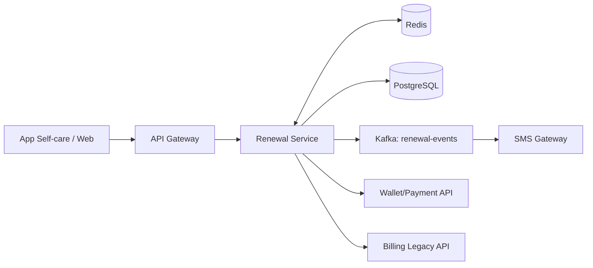
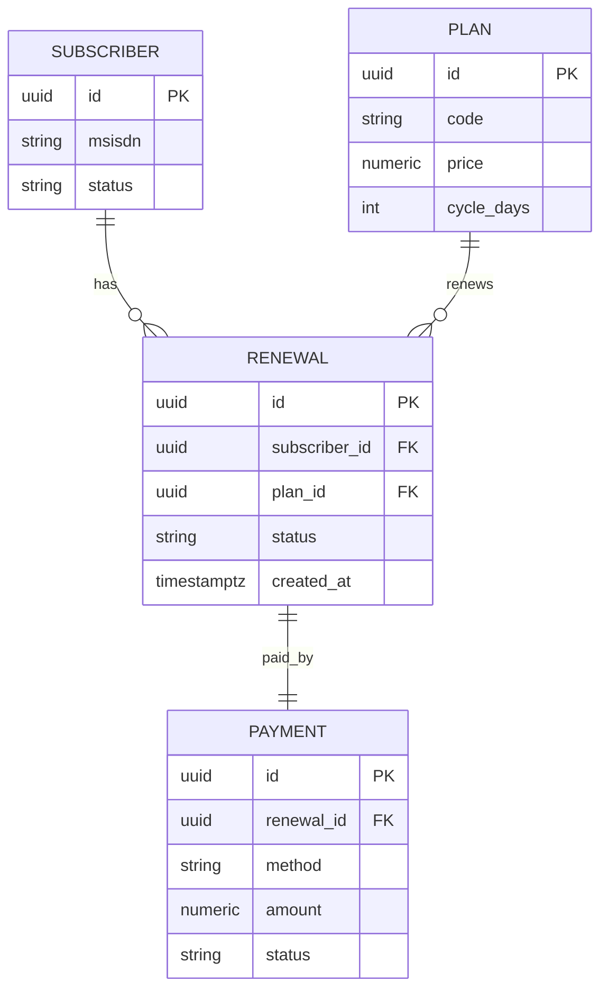
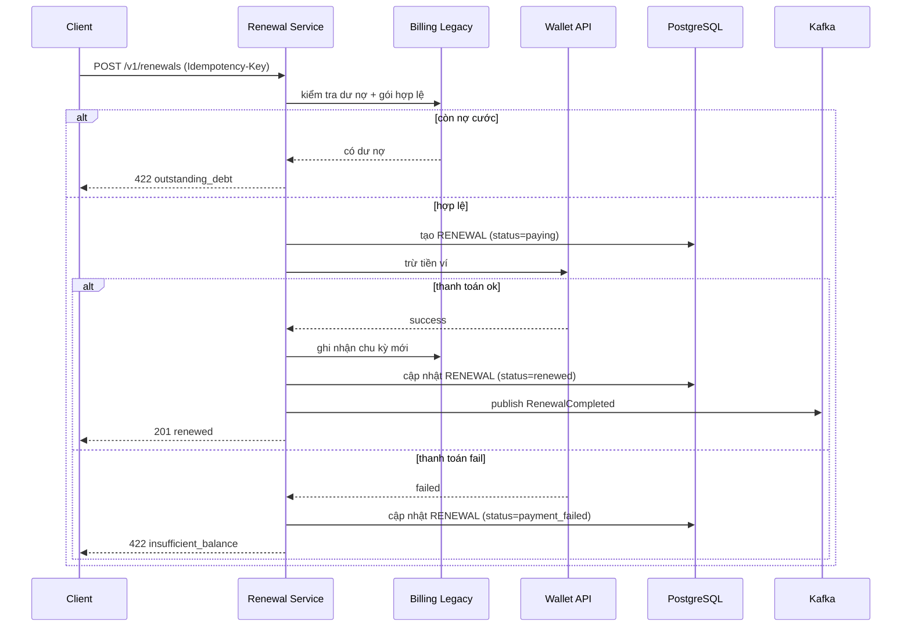

# PRD + Tech Spec (Lean) — `Self-service Gia hạn Gói cước Online`

> **Mục đích:** Tài liệu gộp What / Why / How (PRD + SDD), đủ để engineer (kể cả người mới vào dự án) hiểu, build và vận hành mà không cần hỏi lại.
> **Quy ước:**
> - Điền vào chỗ `<...>`. Mục không dùng → ghi `N/A — lý do`, đừng xóa heading.
> - Living document, để trong repo cùng code (`docs/<feature>.md`), update qua PR + bump version ở Mục 21.
> - Diagram dùng **Mermaid**. Trong `sequenceDiagram` **không dùng dấu `;`** trong nội dung message.

> **Cấu trúc 3 phần:**
> - **Part A — Product (Mục 1–6):** WHAT & WHY.
> - **Part B — Design (Mục 7–16):** HOW.
> - **Part C — Delivery (Mục 17–21):** BUILD / SHIP / OPERATE.

> **Thứ tự đọc gợi ý:**
> 1. Mục 2 (Scope)
> 2. Mục 3 + 4 + 5 (User stories + Functional requirements + Acceptance criteria)
> 3. Mục 7–11 (Glossary, Kiến trúc, Data, API, Luồng)
> 4. Mục 13–16 (Security, Performance, Reliability, Observability)
> 5. Mục 17 + 18 (Testing/DoD, Rollout)
>
> Khi mâu thuẫn: **Scope (Mục 2)** và **Acceptance criteria (Mục 5)** là nguồn chân lý cao nhất.

---

## 0. Metadata

| Field | Value |
|---|---|
| Tên | Self-service Gia hạn Gói cước Online |
| Trạng thái | Building |
| Owner (DRI) | Eng: Phạm Quốc Anh (SA Lead) · Product: Nguyễn Thị Hương (BA) |
| Version | 1.0 |
| Repo / package | `core-telco/renewal-service` |
| Tech stack bắt buộc | Java 21 + Spring Boot, PostgreSQL 16, Redis, Kafka, K8s; client React Native (app self-care) |
| Upstream BRD | `BRD-TEL-RENEW-2026 v1.0` |
| Cập nhật | 2026-03-28 |

---

# PART A — PRODUCT (What & Why)

## 1. Vấn đề & mục tiêu (Why + What)

**Vấn đề:** 100% lượt gia hạn gói cước hiện phải qua tổng đài/điểm giao dịch (~120.000 cuộc/tháng, ~40% tải tổng đài). Khách hàng chờ lâu giờ cao điểm, và ~8% rời mạng ngay tại điểm gia hạn vì không gia hạn kịp ngoài giờ.

**Mục tiêu:** Cho thuê bao tự gia hạn gói đang dùng trên app/web trong dưới 2 phút, 24/7.

| # | Mục tiêu | Đo bằng | Target |
|---|---|---|---|
| G1 | Chuyển lượt gia hạn sang kênh số | Tỷ lệ gia hạn qua app/web | ≥ 60% trong 6 tháng |
| G2 | Giảm tải tổng đài | Cuộc gọi gia hạn/tháng | ≤ 60.000 |
| G3 | Giữ chân thuê bao | Churn tại điểm gia hạn | ≤ 5% |

---

## 2. Phạm vi (Scope)

> Đây là phần **quan trọng nhất** — định ranh giới để không build thừa, không build thiếu.

**In scope (release này LÀM):**
- Gia hạn **gói đang dùng** (giữ nguyên gói, mở chu kỳ mới).
- Thanh toán gia hạn qua **ví nội bộ** và **thẻ**.
- Xem danh sách gói có thể gia hạn + giá/ưu đãi.
- Nhắc hạn + xác nhận kết quả qua SMS/notification.

**Out of scope (release này KHÔNG làm):**
- Đổi/nâng/hạ gói (change plan) — phase 2, Q4/2026.
- Đăng ký thuê bao mới.
- Gia hạn cho thuê bao doanh nghiệp (B2B).
- Gia hạn khi đang **nợ cước** (phải thanh toán nợ trước — chốt ở BRD Q1).

---

## 3. Người dùng & User Stories

> **User story** = nhu cầu + giá trị. **Use case** (chuỗi bước) ở Mục 11.

**Người dùng (actor):**

| Persona | Vai trò & bối cảnh |
|---|---|
| "Minh" — thuê bao trả trước | Cá nhân, dùng app self-care, mức thành thạo trung bình, gia hạn vào cuối tháng |
| "Lan" — Care/Ops Lead | Theo dõi tải tổng đài & tỷ lệ gia hạn số, không thao tác trực tiếp luồng KH |

**User stories** (link về Capability của BRD):

| # | Là... (role) | Tôi muốn... | Để... | Capability (BRD) | Ưu tiên | AC |
|---|---|---|---|---|---|---|
| US1 | thuê bao | xem các gói có thể gia hạn kèm giá & ưu đãi | chọn đúng gói trước khi trả tiền | C2 | Must | AC-1 |
| US2 | thuê bao | gia hạn gói đang dùng chỉ với vài thao tác | duy trì dịch vụ không gián đoạn | C1 | Must | AC-2 |
| US3 | thuê bao | thanh toán gia hạn bằng ví nội bộ | khỏi nhập lại thông tin thẻ | C3 | Must | AC-3 |
| US4 | thuê bao | nhận SMS xác nhận sau khi gia hạn | yên tâm là đã thành công | C4 | Should | AC-4 |

---

## 4. Yêu cầu chức năng (Functional Requirements)

| # | Yêu cầu | Ưu tiên | Liên kết (US · AC) |
|---|---|---|---|
| FR-01 | System MUST trả danh sách gói có thể gia hạn cho một MSISDN đang active | Must | US1 · AC-1 |
| FR-02 | System MUST từ chối gia hạn nếu thuê bao đang nợ cước, kèm thông báo rõ | Must | US2 · AC-2 |
| FR-03 | System MUST tạo đơn gia hạn idempotent (chống double-charge khi retry) | Must | US2, US3 · AC-3 |
| FR-04 | System MUST trừ tiền qua ví nội bộ và chỉ ghi nhận gia hạn khi thanh toán thành công | Must | US3 · AC-3 |
| FR-05 | System SHOULD gửi SMS xác nhận trong vòng 30 giây sau khi gia hạn thành công | Should | US4 · AC-4 |

---

## 5. Acceptance criteria (điều kiện nghiệm thu — phải test được)

**AC-1 — Xem gói có thể gia hạn**
```gherkin
Given thuê bao đang active và đã đăng nhập app
When mở màn hình "Gia hạn"
Then thấy gói đang dùng và danh sách gói có thể gia hạn kèm giá, chu kỳ, ưu đãi
```

**AC-2 — Chặn gia hạn khi nợ cước**
```gherkin
Given thuê bao đang có dư nợ cước
When bấm "Gia hạn"
Then hệ thống từ chối với mã 422 và hiển thị "Vui lòng thanh toán dư nợ trước khi gia hạn"
And không tạo đơn gia hạn nào
```

**AC-3 — Gia hạn & thanh toán ví (idempotent)**
```gherkin
Given thuê bao chọn gói hợp lệ và đủ số dư ví
When gửi yêu cầu gia hạn kèm Idempotency-Key
Then ví bị trừ đúng số tiền một lần duy nhất dù request bị gửi lại
And đơn gia hạn chuyển trạng thái "renewed" và chu kỳ mới được mở
```

**AC-4 — SMS xác nhận**
```gherkin
Given đơn gia hạn vừa chuyển trạng thái "renewed"
When sự kiện RenewalCompleted được phát
Then thuê bao nhận SMS xác nhận trong vòng 30 giây
```

---

## 6. Yêu cầu phi chức năng (high-level)

> Target mức product. Cách đạt chi tiết ở Mục 13 (Security), 14 (Performance), 15 (Reliability), 16 (Observability).

| Khía cạnh | Yêu cầu |
|---|---|
| Performance | API gia hạn p99 < 800ms (chưa tính cổng thanh toán); danh sách gói p95 < 400ms |
| Bảo mật | Auth Bearer JWT; thuê bao chỉ gia hạn cho chính MSISDN của mình; không log PII |
| Quy mô | ~600 RPS giờ cao điểm cuối tháng; ~70.000 lượt gia hạn số/tháng |
| Availability | SLA 99.9% cho luồng gia hạn |
| Tương thích | API `/v1` backward-compatible; iOS 16+ / Android 10+ |
| Dữ liệu nhạy cảm | MSISDN/thông tin thuê bao là PII — mã hóa at rest; data tại DC Việt Nam (Luật ANM) |
| Compliance | NĐ 13/2023 (PDPA); PCI-DSS SAQ-A cho thanh toán thẻ |

---

# PART B — DESIGN (How)

## 7. Glossary & khái niệm chính

| Thuật ngữ | Định nghĩa |
|---|---|
| MSISDN | Số thuê bao di động (định danh khách hàng trong luồng này) |
| Gói cước (plan) | Combo data/thoại/SMS có giá và chu kỳ (cycle_days) |
| Đơn gia hạn (renewal) | Bản ghi một lần gia hạn của thuê bao |
| Idempotency-Key | Khóa client gửi kèm để chống tạo trùng đơn / double-charge khi retry |
| Dư nợ cước | Số tiền thuê bao còn nợ; nếu > 0 thì chặn gia hạn (BRD Q1) |
| Điểm gia hạn | Thời điểm gói hết chu kỳ và cần gia hạn để duy trì dịch vụ |

---

## 8. Kiến trúc tổng thể



| Thành phần | Trách nhiệm | Mới / Có sẵn |
|---|---|---|
| `Renewal Service` | Xử lý gia hạn, validate nợ cước, idempotency, điều phối thanh toán | New |
| `PostgreSQL` | Nguồn chân lý cho đơn gia hạn | New schema |
| `Redis` | Cache catalog gói + lưu Idempotency-Key | Existing |
| `Wallet/Payment API` | Trừ tiền ví/thẻ | Existing (Team Payment) |
| `Billing Legacy API` | Truy vấn gói, dư nợ, ghi nhận chu kỳ mới | Existing (Team Billing) |
| `Kafka renewal-events` | Tách side-effect (SMS) khỏi luồng đồng bộ | New topic |

**Quyết định thiết kế chính (lý do đầy đủ ở Mục 19):** Gửi SMS bất đồng bộ qua Kafka thay vì gọi trực tiếp trong request, để SMS chậm/lỗi không làm fail giao dịch gia hạn.

---

## 9. Data model



- **Index:** `renewal (subscriber_id, created_at DESC)` cho lịch sử gia hạn; `renewal (status)` cho job xử lý đơn `paying` treo.
- **Partition / shard:** N/A ở phase 1 (volume ~70k đơn/tháng, chưa cần).
- **PII:** `subscriber.msisdn` mã hóa column-level; không lưu PAN thẻ (chỉ token từ cổng thanh toán).
- **Retention & delete:** Giữ đơn gia hạn 24 tháng phục vụ đối soát; soft delete (chuyển `status=cancelled`), không xóa cứng.

---

## 10. API / Interface

> [!NOTE]
> Cấu trúc request/response và bộ mã lỗi **tham khảo tiêu chuẩn nội bộ ISC**. Tuân theo convention chung của ISC (đặt tên field, format lỗi, versioning); khung dưới chỉ là mẫu — chỉnh theo chuẩn ISC hiện hành khi áp dụng.

| Method | Path | Mục đích | Auth | Idempotent |
|---|---|---|---|---|
| `GET` | `/v1/plans?msisdn=` | Liệt kê gói có thể gia hạn | Bearer | Yes |
| `POST` | `/v1/renewals` | Tạo đơn gia hạn | Bearer | Yes (Idempotency-Key) |
| `GET` | `/v1/renewals/{id}` | Lấy trạng thái đơn gia hạn | Bearer | Yes |

**Ví dụ contract — `POST /v1/renewals`** *(format theo chuẩn ISC)*

Request:
```json
{ "msisdn": "0901234567", "plan_id": "pl_30d_basic", "payment_method": "wallet" }
```
Response (201):
```json
{ "id": "rnw_01HZX...", "status": "renewed", "amount": "90000", "currency": "VND", "new_cycle_end": "2026-07-08", "created_at": "2026-06-08T09:12:00Z" }
```

**Mã lỗi chuẩn** *(tham khảo bộ mã lỗi tiêu chuẩn nội bộ ISC)***:**

| HTTP | Code | Khi nào |
|---|---|---|
| 400 | `invalid_request` | Body sai / validate fail |
| 401 | `unauthorized` | Thiếu/sai token |
| 403 | `forbidden` | Token không khớp MSISDN yêu cầu gia hạn |
| 404 | `plan_not_found` | Gói không tồn tại hoặc không gia hạn được |
| 409 | `idempotency_conflict` | Cùng Idempotency-Key, body khác |
| 422 | `outstanding_debt` | Thuê bao đang nợ cước (AC-2) |
| 422 | `insufficient_balance` | Ví không đủ số dư |
| 503 | `dependency_unavailable` | Billing/Payment legacy down |

**Versioning & pagination:** URL path `/v1`; `GET /v1/plans` trả list nhỏ (≤ 20 gói) nên không phân trang.

---

## 11. Luồng chính & state machine (use case / key flow)

> Đây là **use case** — chuỗi bước tương tác, gồm luồng chính + nhánh lỗi. Bổ trợ cho user story ở Mục 3.



**State machine `RENEWAL.status`:** `created → paying → renewed` (thành công) hoặc `paying → payment_failed`. Transition khác → trả 409.

---

## 12. Algorithms / business logic phức tạp

**Tính ngày kết thúc chu kỳ mới (new_cycle_end):**
- Input: `current_cycle_end`, `cycle_days` của gói, `now`.
- Logic: `new_cycle_end = max(now, current_cycle_end) + cycle_days`. Nếu gia hạn sau khi đã hết hạn → tính từ `now`; nếu còn hạn → cộng nối tiếp.
- Lưu ý: trường hợp **gia hạn trước hạn (early renewal)** có cộng dồn hay không đang chờ chốt — xem Q1 (Mục 21). Hiện tại chặn gia hạn khi còn > 7 ngày.

**Áp ưu đãi:** giá hiển thị = giá gói − khuyến mãi đang hiệu lực cho MSISDN (lấy từ billing). Không tự suy diễn ưu đãi ở service.

---

## 13. Security & privacy

**Authn / Authz:** Bearer JWT do auth-service phát (RS256). **Authz quan trọng:** `subject` trong token phải khớp `msisdn` trong request — thuê bao chỉ gia hạn cho chính mình, lệch → `403 forbidden`. Service ↔ billing/wallet qua mTLS trong VPC.

**Threat model (rút gọn):**

| Mối đe dọa | Phòng vệ |
|---|---|
| Gia hạn hộ số khác (Spoofing/Elevation) | Bắt buộc MSISDN khớp subject của token; deny-by-default |
| Sửa số tiền/gói (Tampering) | TLS; service tự tính giá từ billing, không tin giá client gửi |
| Lộ PII trong log (Info disclosure) | Redact MSISDN trong log; mã hóa at rest |
| Double-charge khi retry | Idempotency-Key bắt buộc trên `POST /v1/renewals` |
| DoS giờ cao điểm | Rate limit 10 req/phút/MSISDN tại gateway + circuit breaker |

**Input validation:** validate format MSISDN, `plan_id` theo whitelist từ catalog, `payment_method ∈ {wallet, card}`; parameterized query (chống SQLi).
**Secrets:** credential gọi billing/wallet lưu Vault, nạp lúc boot, rotate 90 ngày; không commit, không log.
**Privacy / PDPA:** MSISDN là PII — hỗ trợ export/xóa qua self-care; ghi audit log (user_id + request_id) trên mọi giao dịch gia hạn; data lưu tại DC Việt Nam.

---

## 14. Performance & capacity

**Performance budget:**

| Metric | Target | Đo ở |
|---|---|---|
| `GET /v1/plans` p95 | < 400 ms | Server-side |
| `POST /v1/renewals` p99 | < 800 ms | Server-side, trừ thời gian cổng thanh toán |

**Capacity:** ~600 RPS peak cuối tháng; ~70.000 đơn/tháng. Sizing: 6 pod × 1 vCPU / 1GB, headroom 2× peak; HPA scale khi CPU > 70%.

**Caching:**

| Cache | Key | TTL | Invalidation |
|---|---|---|---|
| Catalog gói | `plans:<segment>` | 5 phút | On catalog update |
| Idempotency | `idem:<key>` | 24h | TTL only |

**Database:** read/write ~ 4:1; 2 read replica cho truy vấn lịch sử; connection pool 20/pod (tổng 120 < max_connections 200, chừa 20% headroom); query > 100ms phải justify.

---

## 15. Reliability & failure modes

**Failure mode analysis:**

| Failure | Phát hiện | Tác động | Giảm thiểu | Phục hồi |
|---|---|---|---|---|
| Billing legacy down | circuit breaker | không gia hạn được | fail fast + báo "thử lại sau"; không trừ tiền | auto-close khi billing hồi |
| Wallet API down | timeout/error | không thanh toán được | đơn giữ `created`, chưa trừ tiền | KH thử lại; idempotent |
| Kafka down (SMS) | producer error | gia hạn vẫn OK, SMS trễ | buffer local + retry; eventually consistent | replay từ buffer |
| Pod crash | liveness probe | 1 pod re-route | multi-replica | auto-restart |
| DB primary down | health check | write fail | read qua replica | failover (RTO 15m) |

**Retry & timeout:**

| Call | Timeout | Retry | Backoff |
|---|---|---|---|
| Billing (đọc nợ/gói) | 3s | 2 | Exponential + jitter |
| Wallet (trừ tiền) | 5s | **Không tự retry** — chỉ thử lại theo Idempotency-Key | n/a |
| DB query | 2s | No | n/a |

**Circuit breaker:** mở khi > 50% lỗi trên 20 request/10s với billing & wallet; half-open sau 30s; fallback = báo lỗi thân thiện, không tạo đơn.
**DR:** RTO 15 phút · RPO 5 phút; backup DB hằng ngày + WAL; restore drill hàng quý.

---

## 16. Observability

**Logging:** JSON; field bắt buộc `timestamp, level, service, version, request_id, trace_id, msisdn_hash`; MSISDN redact; ERROR → page on-call.

**Metrics (RED):**

| Metric | Type | Mục đích |
|---|---|---|
| `renewal_requests_total{status}` | Counter | Rate & error rate |
| `renewal_duration_seconds` | Histogram | Latency p50/p95/p99 |
| `renewal_success_rate` | Gauge | KPI G1 (tỷ lệ gia hạn số) |
| `wallet_charge_failures_total` | Counter | Cảnh báo sự cố thanh toán |

**Tracing:** trace_id propagate qua header W3C; span: gateway → service → billing → wallet → db → kafka publish; sampling 100% lỗi, 1% OK.

**Alerts:**

| Alert | Điều kiện | Severity | Hành động |
|---|---|---|---|
| `renewal.error_rate` | > 1% trong 5m | P1 | Page on-call |
| `renewal.payment_failure` | tăng đột biến > 3× baseline | P1 | Page on-call |
| `renewal.kafka_lag` | > 1000 msg trong 10m | P2 | Notify (SMS bị trễ) |

---

# PART C — DELIVERY (Build / Ship / Operate)

## 17. Testing & Definition of Done

**Mức test tối thiểu:**
- Unit: logic chặn nợ cước, tính `new_cycle_end`, áp ưu đãi
- Integration: mỗi API endpoint — happy path + error path (nợ cước, hết số dư, billing down)
- E2E: luồng gia hạn ví thành công + nhánh lỗi ở Mục 11 (phủ US Must ở Mục 3)
- Load: đạt budget Mục 14 ở 600 RPS; Chaos: tắt billing/wallet kiểm tra circuit breaker

**Definition of Done (checklist tự kiểm trước khi báo hoàn thành):**
- [ ] Mọi user story `Must` (Mục 3) và FR `Must` (Mục 4) đã implement
- [ ] Mọi Acceptance criteria (Mục 5) pass
- [ ] Test ở các mức trên pass; không giảm coverage hiện có
- [ ] Đạt yêu cầu phi chức năng (Mục 6) — đặc biệt Security (Mục 13): MSISDN khớp token, không log PII, không lưu PAN
- [ ] Metrics, alerts, logging (Mục 16) đã deploy
- [ ] Feature flag `renewal_self_service` + rollback plan (Mục 18) sẵn sàng
- [ ] Linter / formatter sạch; tài liệu này + README updated
- [ ] Không động vào phần Out of scope (Mục 2)

---

## 18. Rollout & deployment

- **Rollout stages:** dogfood (nhân viên ISC) → closed beta (5% thuê bao opt-in) → GA toàn bộ. Tiêu chí ra mỗi stage: không P0/P1, error rate < 1%.
- **Deploy pattern:** Canary 5% → 25% → 50% → 100%, mỗi bước cách 30 phút theo dõi.
- **Feature flag + kill switch:** flag `renewal_self_service`, mặc định OFF; tắt flag = ẩn luồng gia hạn online ngay, không cần deploy.
- **DB migration:** additive — thêm bảng `renewal`, `payment` (không đụng schema billing legacy). Mỗi migration có down-migration đã test.
- **Auto-rollback trigger:** error rate > baseline × 2 HOẶC p99 > 1.5× SLO trong 5 phút.

---

## 19. Alternatives considered

| Alternative | Tóm tắt | Vì sao loại |
|---|---|---|
| A — Gửi SMS đồng bộ trong request | Gọi SMS gateway ngay trước khi trả 201 | SMS gateway chậm/timeout sẽ làm fail giao dịch gia hạn dù tiền đã trừ → tách qua Kafka (async) |
| B — Tự xây module thanh toán riêng | Renewal service tự tích hợp ngân hàng/thẻ | Tốn effort + gánh PCI scope; ví/cổng nội bộ đã đạt chuẩn → tái dùng |
| C — Cron quét và auto-gia hạn | Hệ thống tự gia hạn khi tới hạn | Ngoài scope (cần consent/đăng ký auto-renew); để phase sau |

**Build vs buy:** Dùng **cổng thanh toán nội bộ đạt PCI** thay vì tự xử lý thẻ → giữ scope PCI ở mức SAQ-A.

---

## 20. Operational concerns

- **On-call & runbook:** squad Renewal trực luân phiên; Operations Runbook: `confluence/.../renewal-runbook` (bắt buộc trước GA); mỗi alert ở Mục 16 map tới một section runbook.
- **Cost:** infra tăng thêm ~$1.200/tháng (compute + Redis + Kafka). Phí cổng thanh toán tính theo giao dịch — theo dõi ở cost dashboard.
- **Maintenance:** ~16 dev-hours/tháng post-launch; cần kỹ năng Spring Boot + Kafka + tích hợp billing; bus factor: hiện 2 người (Vũ Đình Nam + 1) — cần thêm 1 người nắm luồng billing.

---

## 21. Phụ thuộc · Rủi ro · Câu hỏi mở · Change log

**Phụ thuộc (blocker cần có trước khi build):**
| Phụ thuộc | Chủ sở hữu | Trạng thái |
|---|---|---|
| API gói + dư nợ + ghi nhận gia hạn (billing legacy) | Team Billing | Sẵn sàng (2026-04-10) |
| Endpoint trừ tiền ví idempotent | Team Payment | Đang làm (2026-04-15) |
| Template SMS brandname | Team Marketing | Đang làm |

**Rủi ro & giả định:**
- Rủi ro: Payment/Billing legacy lỗi giờ cao điểm → giảm thiểu: circuit breaker + retry có backoff + báo lỗi rõ ràng (Mục 15).
- Giả định: Ví nội bộ chịu được 3× lưu lượng hiện tại không cần thay đổi (đang chờ Team Payment xác nhận — BRD A2).

**Câu hỏi mở (chưa quyết — KHÔNG tự ý quyết, phải hỏi owner):**
| # | Câu hỏi | Trạng thái |
|---|---|---|
| Q1 | Có cho gia hạn trước hạn (early renewal) không, và cộng dồn chu kỳ thế nào? | Open — hỏi PO |

**Change log:**
| Version | Ngày | Người sửa | Tóm tắt thay đổi |
|---|---|---|---|
| 0.5 | 2026-03-20 | P.Q.Anh | Draft technical design sau review với Billing/Payment |
| 1.0 | 2026-03-28 | P.Q.Anh | Approved baseline, khớp BRD v1.0; bổ sung đầy đủ phần SDD |
